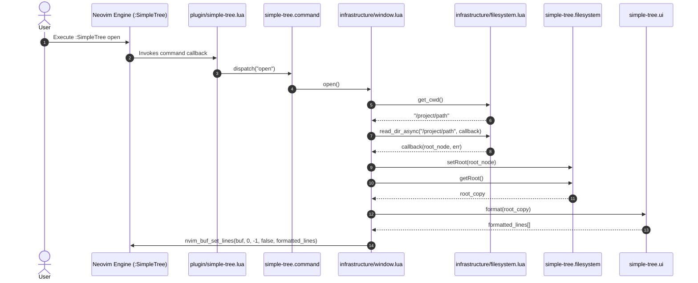

# Architectural Specification: System Topology & Component Design Principles

**Status:** Approved  
**Architecture Pattern:** Ports and Adapters (Hexagonal Architecture)  
**Target Environment:** NeoVim v0.11.5+ (Lua 5.1 / LuaJIT 2.1)

---

## 1. Architectural Overview & System Philosophy

The `simple-tree` system is architected around the **Ports and Adapters (Hexagonal Architecture)** design pattern. The core objective is **total decoupling** of core filesystem domain logic from Neovim engine APIs (`vim.api`, `vim.fn`, `vim.uv`, `vim.bo`, `vim.wo`).

```mermaid
graph TB
    subgraph Neovim Framework & OS Boundary
        UserCmd["Neovim User Commands (:SimpleTree)"]
        WinBuf["Neovim Window & Buffer Engine"]
        LibUV["Neovim Event Loop (vim.uv fs_scandir)"]
    end

    subgraph Infrastructure Layer (Adapters)
        PluginInit["plugin/simple-tree.lua<br/>(Initialization & Command Setup)"]
        WinInfra["lua/simple-tree/infrastructure/window.lua<br/>(Buffer/Window Driver)"]
        FSInfra["lua/simple-tree/infrastructure/filesystem.lua<br/>(Async OS File Scanner)"]
    end

    subgraph Pure Domain Layer (Core Engine)
        CmdDispatcher["lua/simple-tree/command.lua<br/>(Command Dispatcher)"]
        FSModel["lua/simple-tree/filesystem.lua<br/>(In-Memory Tree State)"]
        UIFormatter["lua/simple-tree/ui.lua<br/>(Pure String Line Formatter)"]
        UtilHelpers["lua/simple-tree/util.lua<br/>(Recursive Tree Utilities)"]
    end

    UserCmd --> PluginInit
    PluginInit --> CmdDispatcher
    CmdDispatcher --> WinInfra
    WinInfra --> FSInfra
    FSInfra --> LibUV
    FSInfra --> FSModel
    WinInfra --> FSModel
    WinInfra --> UIFormatter
    UIFormatter --> WinBuf
```

### 1.1 Core Engineering Tenets

1. **Strict Boundary Isolation:** Domain logic must have zero knowledge of Neovim API contracts. It operates strictly on plain Lua tables, strings, booleans, and functions.
2. **Encapsulation & Immutability:** Internal state mutations are restricted to dedicated state managers (`filesystem.lua`). Exposed states must return deep copies via [`util.deepCopy`](file:///home/rodrigolm/git/simple-tree/lua/simple-tree/util.lua#L6-L26) to prevent external reference leaks.
3. **Fail-Fast & Deterministic Execution:** Side effects (file IO, buffer writes) are isolated inside infrastructure modules. Functions in domain modules must be deterministic and pure.
4. **Asynchronous Non-Blocking IO:** Filesystem traversal is performed asynchronously over Neovim's `libuv` event loop (`vim.uv.fs_scandir`), guaranteeing zero UI main-thread blocking.

---

## 2. System Topology & Component Responsibilities

```
simple-tree/
├── lua/
│   ├── simple-tree.lua                   # Plugin configuration setup entrypoint
│   └── simple-tree/
│       ├── command.lua                   # Pure domain command dispatcher & parser
│       ├── filesystem.lua                # In-memory filesystem tree state store
│       ├── ui.lua                        # Pure tree-to-string line formatter
│       ├── util.lua                      # Deep-copy and tree helper utilities
│       └── infrastructure/
│           ├── filesystem.lua            # Async libuv OS directory scanner (Vim API boundary)
│           └── window.lua                # Neovim window/buffer driver (Vim API boundary)
├── plugin/
│   └── simple-tree.lua                   # Plugin bootstrapper & Vim command installer
├── specs/                                # Technical specifications and ADRs
└── tests/                                # Busted unit & integration test suites
```

### 2.1 Layer Breakdown

| Module Path | Layer | Responsibilities & Constraints |
| :--- | :--- | :--- |
| `plugin/simple-tree.lua` | Entrypoint Adapter | Registers Neovim `:SimpleTree` commands and autocommands. Must delegate immediately to `simple-tree.command`. |
| `lua/simple-tree.lua` | Config Interface | Validates and stores user plugin settings (`setup(opts)`). |
| `lua/simple-tree/command.lua` | Domain Dispatcher | Parses command arguments (`open`, `close`, `toggle`) and maps them to domain actions. |
| `lua/simple-tree/filesystem.lua` | Domain Model | Maintains in-memory directory `Node` tree. Enforces read immutability via deep copying. |
| `lua/simple-tree/ui.lua` | Domain View | Pure function converting `Node` hierarchies into printable buffer line arrays (`string[]`). |
| `lua/simple-tree/util.lua` | Domain Utility | General-purpose tree traversal and deep cloning logic. |
| `lua/simple-tree/infrastructure/filesystem.lua` | Infrastructure Adapter | Wraps `vim.uv.fs_scandir` to scan directories asynchronously and construct `Node` objects. |
| `lua/simple-tree/infrastructure/window.lua` | Infrastructure Adapter | Manages Neovim scratch buffers (`nvim_create_buf`) and sidebar split windows (`nvim_open_win`, `nvim_buf_set_lines`). |

---

## 3. Strict Boundary Constraints (Vim API Isolation)

To preserve long-term maintainability and testability, the system enforces a strict API access rule:

> [!IMPORTANT]
> **The `vim` global object (`vim.api`, `vim.fn`, `vim.uv`, `vim.bo`, `vim.wo`, etc.) is strictly forbidden inside core domain modules (`lua/simple-tree/*.lua`).**  
> Direct access to `vim` is permitted **ONLY** within:
> 1. `plugin/**/*.lua`
> 2. `lua/simple-tree/infrastructure/**/*.lua`
> 3. `tests/**/*.lua` (restricted to testing infrastructure adapters).

### 3.1 Static Analysis Verification

Static analysis via `luacheck` automatically validates this rule. Any reference to `vim` inside `lua/simple-tree/*.lua` (excluding `infrastructure/`) constitutes a build-breaking architectural violation.

---

## 4. Unidirectional Data & Control Flow



---

## 5. Testing Strategy

1. **Pure Unit Testing (Domain Layer):**
   * Domain modules (`filesystem.lua`, `ui.lua`, `util.lua`, `command.lua`) are tested in isolation using Busted without instantiating Neovim windows or mocks.
2. **Integration Testing (Infrastructure Layer):**
   * Infrastructure adapters (`infrastructure/filesystem.lua`, `infrastructure/window.lua`) are tested within an embedded Neovim runtime (`nlua`), verifying actual buffer states, window flags, and async filesystem callbacks.
